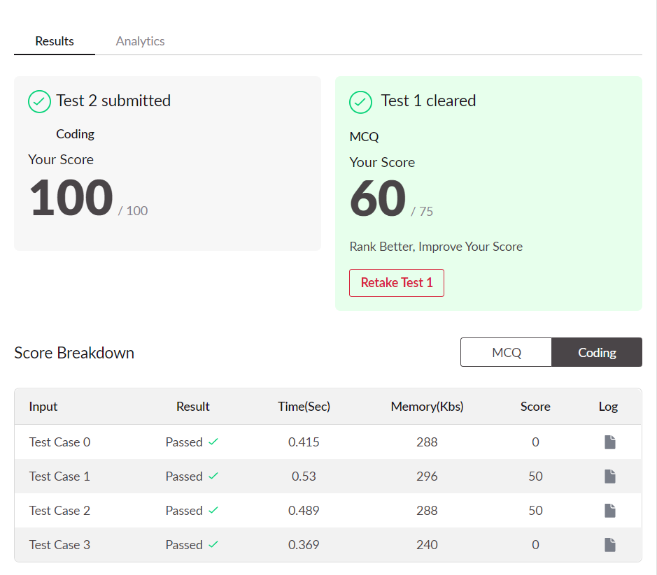

# TechGiG-Win-or-Lose-Challenge-Solution
A new fighting game has become popular. There are N number of villains in it, each having some strength. There are N players in the game with each having some energy. The energy is used to kill the villains. A villain can be killed only if the energy of the player is greater than the strength of the villain. 

Input Format
The first line of input consists of number of test cases, T.
The first line of each test case consists of number of villains and player, N.
The second line of each test case consist of the N space separated by strengths of Villains.
The third line of each test case consist of N space separated by energy of players.

Constraints
1<= T <=10
1<= N <=1000
1<= strength , energy <=100000

Output Format
For each test case, Print WIN if all villains can be killed else print LOSE in separate lines.

Sample TestCase 1
Input
1
6
112 243 512 343 90 478
500 789 234 400 452 150
Output
WIN
Explanation
For the given test case, If we shuffle the players and villains, we can observe that all the villains can be killed by players.

Player	Villain	RESULT
500	478	WIN
789	512	WIN
234	112	WIN
400	243	WIN
452	343	WIN
150	90	WIN

As all the villains can be killed by the players, MAXI will WIN the game. Thus, the final output is WIN.

Sample TestCase 2
Input
2
6
10 20 50 100 500 400 
30 20 60 70 90 490 
5
10 20 30 40 50 
40 50 60 70 80 
Output
LOSE
WIN

